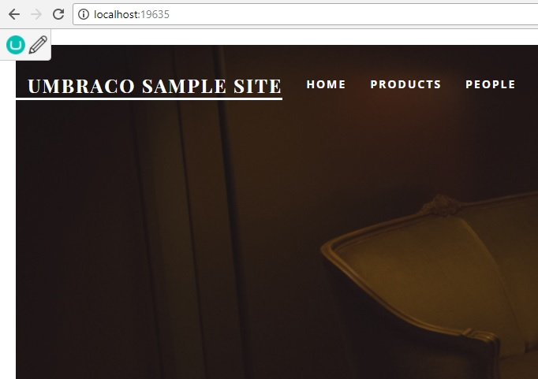

# Umbraco.EditButton

Install using NuGet

```
Install-Package Flaeng.Umbraco.EditButton
```

alternatively use Umbraco Packages

A simple edit button that shows up on the frontend when you're allready signed in to the backoffice.



If you use ClientDependency just add the following to your &lt;body&gt;

```C#
@Html.Partial("~/App_Plugins/Flaeng.Umbraco.EditButton/EditButton.cshtml")
```

If you dont use ClientDendency add the line above and the following

```HTML
<link rel="stylesheet" href="/App_Plugins/Flaeng.Umbraco.EditButton/styles.css" />
```

The edit-icon is made by Umar Irshad

https://www.iconfinder.com/icons/290135/draw_edit_pen_pencil_write_icon#size=128

# Known issues

There can be issues with dictionary items on Umbraco 7.X.X.X. The issue and solution are described here:

https://github.com/Flaeng/Umbraco.EditButton/issues/1#event-2710000083 

Thank you to [enkelmedia](https://github.com/enkelmedia) for finding the bug and solution
