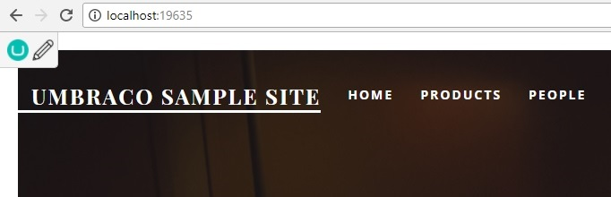

# Umbraco.EditButton

A simple edit button that shows up on the frontend when you're allready signed in to the backoffice.

If you use ClientDependency just add the following to your <body>

@Html.Partial("~/App_Plugins/Flaeng.Umbraco.EditButton/EditButton.cshtml")

If you dont use ClientDendency add the line above and the following

<link rel="stylesheet" href="/App_Plugins/Flaeng.Umbraco.EditButton/styles.css" />

The edit-icon is made by Umar Irshad

https://www.iconfinder.com/icons/290135/draw_edit_pen_pencil_write_icon#size=128